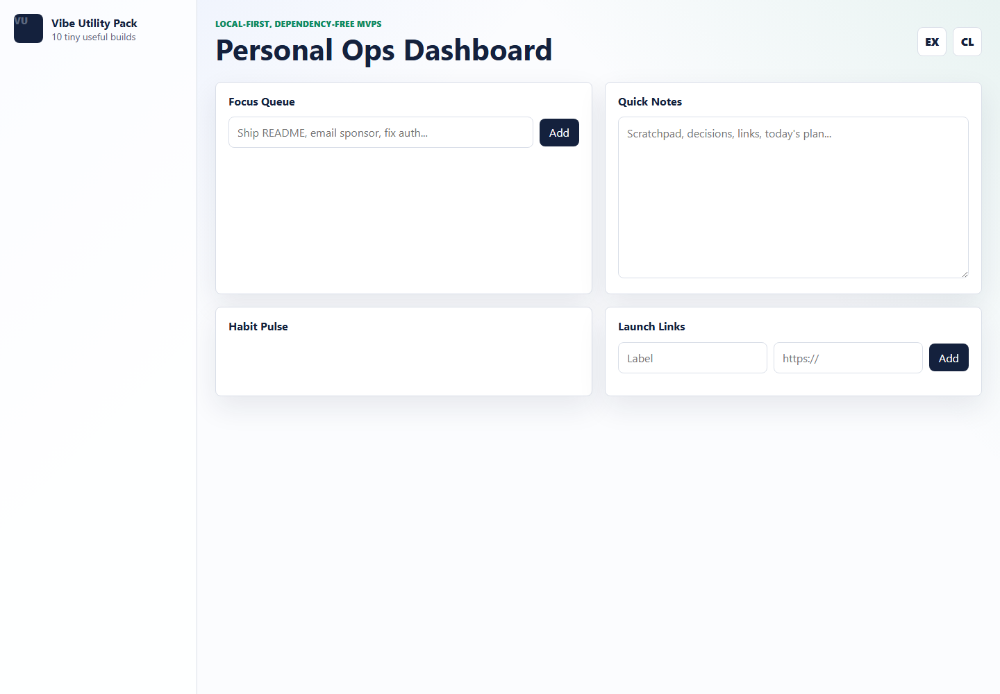
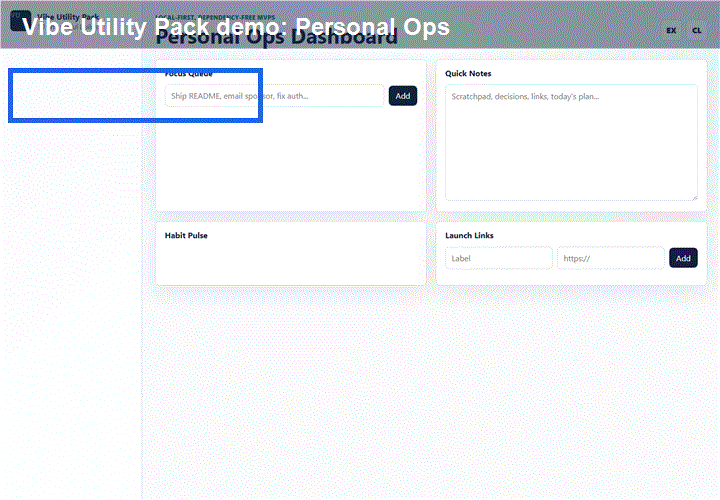

# Vibe Utility Pack

[](https://github.com/WhoVick/vibe-utility-pack/actions/workflows/check.yml)


Local-first maintainer toolkit with ten dependency-free utilities for README review, repo health, screenshot-to-issue reports, changelog drafting, meeting-note cleanup, and contributor onboarding.

The browser app runs on GitHub Pages with no backend, account, analytics, or API key. The CLI scripts in `bin/` cover the maintainer workflows that benefit from terminal input.

**Live demo:** https://whovick.github.io/vibe-utility-pack/

**Why this exists:** small OSS projects often fail at the same maintenance chores: unclear READMEs, weak issue reports, missing release notes, rough contributor setup, and undocumented security assumptions. This repo packages those checks into fast local tools that are easy to inspect, fork, and extend.

**Current OSS signals:** MIT license, CI, GitHub Pages, releases, issue templates, PR template, security policy, contributing guide, parser regression tests, offline-capable static app, security model, adoption plan, and optional Codex/API automation plan.





## What is inside

- Personal Ops Dashboard: tasks, notes, habits, and launch links stored locally.
- README Roast & Fixer: scores a README and generates a better outline.
- Tiny Finance Tracker: imports CSV expenses, categorizes rows, and exports clean CSV.
- Local AI Prompt Vault: stores prompts, tags them, and renders `{variables}`.
- Screenshot-to-Issue Generator: uploads a screenshot, draws annotations, and creates issue markdown.
- Repo Health Badge Generator: checks project readiness signals and writes a health report.
- Meeting Notes to Action Items: extracts decisions, risks, owners, and due dates from messy notes.
- Dev Environment Doctor: checks common local tools and project setup from the CLI.
- Small Business Website Starter: turns a simple config into a polished static HTML page.
- What Changed? Changelog Bot: groups commit messages into release notes.

## Quick start

Open `index.html` directly in a browser, or run a tiny local server:

```bash
npm start
```

Then open:

```text
http://localhost:4173
```

The hosted demo also registers a small service worker, so repeat visits can open the toolkit offline from GitHub Pages.

## CLI tools

```bash
npm run doctor
npm run repo-health
npm run changelog -- --from-file examples/commit-log.txt
npm run pr-summary -- --from-file examples/pr-context.txt
```

Useful direct commands:

```bash
node bin/dev-doctor.mjs --markdown
node bin/repo-health.mjs --write
type examples\commit-log.txt | node bin/changelog.mjs
type examples\pr-context.txt | node bin/pr-summary.mjs
```

On macOS/Linux, replace `type` with `cat`.

## Project structure

```text
.
|-- index.html
|-- styles.css
|-- app.js
|-- manifest.webmanifest
|-- sw.js
|-- src/
|   `-- core.mjs
|-- tests/
|   `-- core.test.mjs
|-- bin/
|   |-- changelog.mjs
|   |-- dev-doctor.mjs
|   |-- repo-health.mjs
|   `-- static-server.mjs
`-- examples/
```

## Optional OpenAI CLI Prototype

`vibe-pr-summary` is the first API-powered maintainer workflow. It summarizes pull request context from a file or stdin.

By default it does not call OpenAI. It creates a local checklist and prints the privacy rules:

```bash
npm run pr-summary -- --from-file examples/pr-context.txt
```

To inspect the prompt before sending anything:

```bash
npm run pr-summary -- --from-file examples/pr-context.txt --show-prompt
```

To opt in to the OpenAI Responses API:

```bash
OPENAI_API_KEY=sk-... npm run pr-summary -- --from-file examples/pr-context.txt --send-to-openai
```

See `docs/API_PRIVACY.md` before using API mode.

## GitHub publishing checklist

- Run `npm test`.
- Run `npm run repo-health`.
- Open the GitHub Pages demo and verify the service worker registers.
- Keep `SECURITY.md`, `CONTRIBUTING.md`, issue templates, and release notes current.

## Maintainer Workflows

This repository is designed as a practical OSS maintenance toolkit. Several tools directly support common maintainer tasks:

- README quality checks for new projects and pull requests.
- Screenshot-to-issue markdown for cleaner bug reports.
- Repository health checks for release readiness.
- Meeting/action extraction for project coordination.
- Changelog generation from commit messages.
- Dev environment checks for contributor onboarding.

The planned Codex/API integration path is optional and maintainer-focused: summarize pull requests, suggest issue labels, flag documentation gaps, generate release notes, and review parser changes for regressions while keeping the app usable without API keys.

Planning docs:

- `docs/DEMO_SCRIPT.md`
- `docs/MAINTAINER_WORKFLOWS.md`
- `docs/ADOPTION.md`
- `docs/API_PRIVACY.md`
- `docs/SECURITY_MODEL.md`
- `docs/OPENAI_AUTOMATION_PLAN.md`
- `docs/CODEX_FOR_OSS_APPLICATION.md`

## OSS Status

This is an early-stage public OSS project maintained by `WhoVick`. It currently prioritizes clear documentation, security-conscious local-first behavior, issue templates, review checklists, and a low-dependency architecture so contributors can inspect and fork it easily.

## Roadmap

- Publish the CLI tools as an npm package once command output stabilizes.
- Prototype one optional OpenAI-powered maintainer workflow.
- Run an accessibility and keyboard navigation pass across all ten tools.
- Add drag-and-drop import/export for each tool.
- Split each MVP into its own package when one gets traction.

## Community

- See `CONTRIBUTING.md` for contribution guidelines.
- See `SECURITY.md` for vulnerability reporting.
- Leave maintainer feedback in issue #12: https://github.com/WhoVick/vibe-utility-pack/issues/12
- Use GitHub issues for focused bugs, feature requests, and documentation tasks.
- Use GitHub Discussions for broader support questions and project ideas.

## License

MIT
