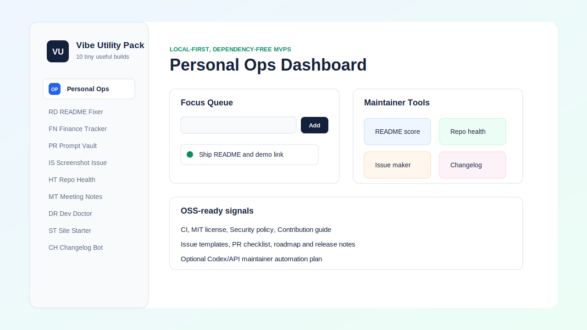

# Vibe Utility Pack

[](https://github.com/WhoVick/vibe-utility-pack/actions/workflows/check.yml)


Ten small, useful, dependency-free MVPs you can build on fast and publish on GitHub. The browser app runs as a local-first toolkit, and the `bin/` folder includes CLI versions for the developer-focused ideas.

**Live demo:** https://whovick.github.io/vibe-utility-pack/



## What is inside

- Personal Ops Dashboard: tasks, notes, habits, and launch links stored locally.
- README Roast & Fixer: scores a README and generates a better outline.
- Tiny Finance Tracker: imports CSV expenses, categorizes rows, and exports clean CSV.
- Local AI Prompt Vault: stores prompts, tags them, and renders `{variables}`.
- Screenshot-to-Issue Generator: uploads a screenshot, draws annotations, and creates issue markdown.
- Repo Health Badge Generator: checks project readiness signals and writes a health report.
- Meeting Notes to Action Items: extracts decisions, risks, owners, and due dates from messy notes.
- Dev Environment Doctor: checks common local tools and project setup from the CLI.
- Small Business Website Starter: turns a simple config into a polished static HTML page.
- What Changed? Changelog Bot: groups commit messages into release notes.

## Quick start

Open `index.html` directly in a browser, or run a tiny local server:

```bash
npm start
```

Then open:

```text
http://localhost:4173
```

## CLI tools

```bash
npm run doctor
npm run repo-health
npm run changelog -- --from-file examples/commit-log.txt
```

Useful direct commands:

```bash
node bin/dev-doctor.mjs --markdown
node bin/repo-health.mjs --write
type examples\commit-log.txt | node bin/changelog.mjs
```

On macOS/Linux, replace `type` with `cat`.

## Project structure

```text
.
|-- index.html
|-- styles.css
|-- app.js
|-- bin/
|   |-- changelog.mjs
|   |-- dev-doctor.mjs
|   |-- repo-health.mjs
|   `-- static-server.mjs
`-- examples/
```

## GitHub publishing checklist

- Add screenshots or a short GIF to the README.
- Run `npm test`.
- Run `npm run repo-health`.
- Create a public repository and push this folder.
- Turn on GitHub Pages with the repository root as the source, or host `index.html` anywhere static files are supported.

## Maintainer Workflows

This repository is designed as a practical OSS maintenance toolkit. Several tools directly support common maintainer tasks:

- README quality checks for new projects and pull requests.
- Screenshot-to-issue markdown for cleaner bug reports.
- Repository health checks for release readiness.
- Meeting/action extraction for project coordination.
- Changelog generation from commit messages.
- Dev environment checks for contributor onboarding.

The planned Codex/API integration path is optional and maintainer-focused: summarize pull requests, suggest issue labels, flag documentation gaps, generate release notes, and review parser changes for regressions while keeping the app usable without API keys.

## OSS Status

This is an early-stage public OSS project maintained by `WhoVick`. It currently prioritizes clear documentation, security-conscious local-first behavior, issue templates, review checklists, and a low-dependency architecture so contributors can inspect and fork it easily.

## Roadmap

- Add drag-and-drop import/export for each tool.
- Add a service worker for offline install.
- Split each MVP into its own package when one gets traction.
- Add GitHub issue template export for the screenshot tool.
- Add optional OpenAI API-powered maintainer automations behind explicit user-owned API keys.

## Community

- See `CONTRIBUTING.md` for contribution guidelines.
- See `SECURITY.md` for vulnerability reporting.
- Use GitHub issues for focused bugs, feature requests, and documentation tasks.
- Use GitHub Discussions for broader support questions and project ideas.

## License

MIT
